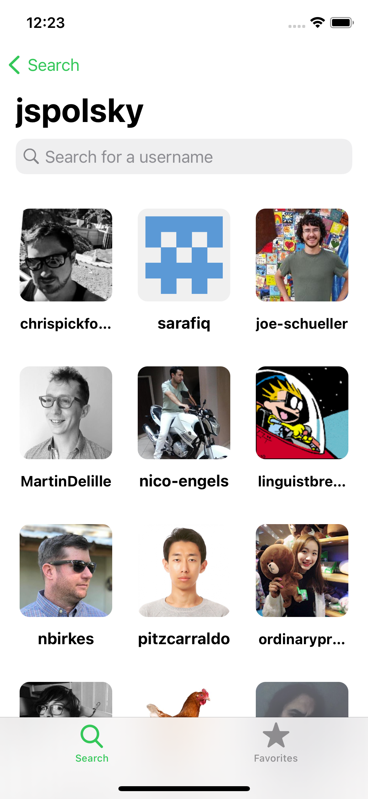
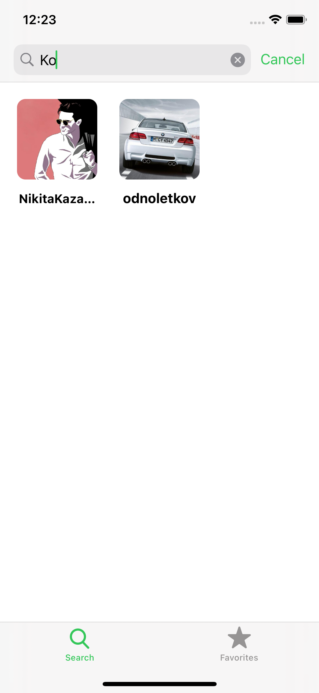
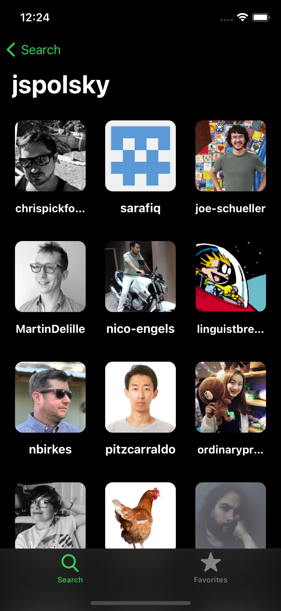
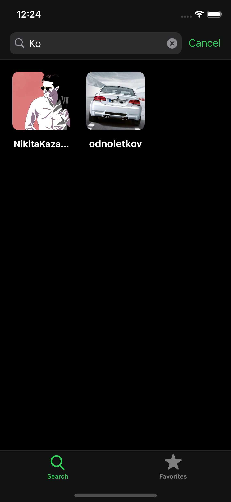

#  Github API UI

An iOS app written in Swift to display records from Github's API. 

Created during Sean Allen's iOS Dev Job Take Home Project course.   

##### Overview:
Lookup a Github user to see their followers, search the results set, look at detailed user information about a follower, view their Github profile using an in-app browser, and add or remove follower searches from a list of favourites

##### Notable features include:
* Built using Programmatic UI (rather than Storyboards)
* Uses iOS 13 diffable data source for filtering of collection view
* Uses Swift 5 "Result" type for network call and pesistence result handling
* Dark mode support
* Persists user favourites between app sessions
* Uses Dynamic Type to increase accessibility
* Uses NSCache for image caching to improve app performance
* Use of Safari View Controller
* All native code - no third party libraries used

  

##### Light mode:

  

##### Dark mode:

